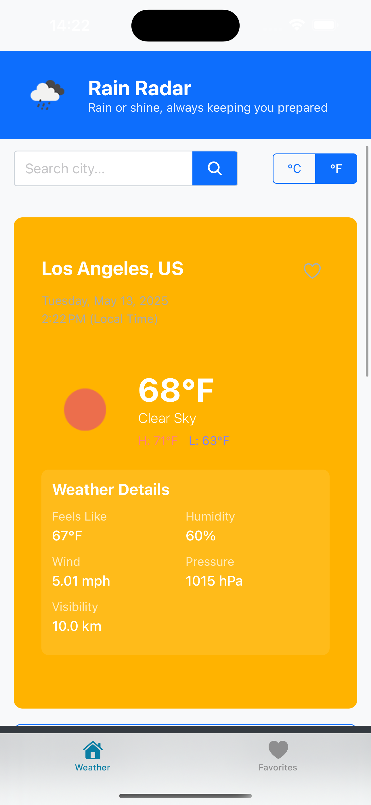
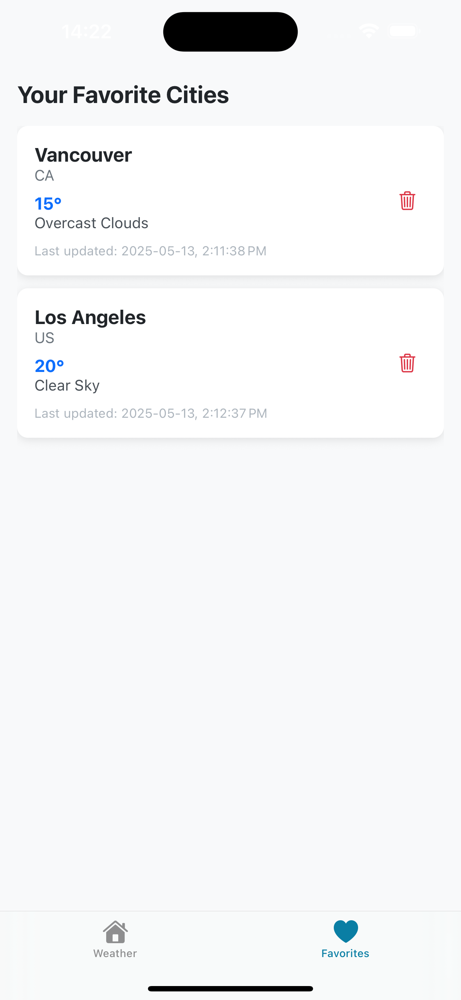
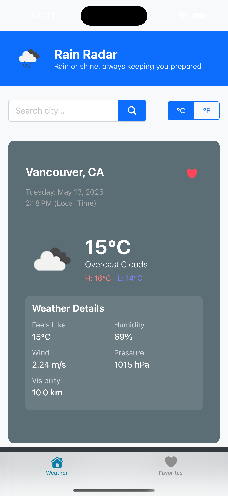

# Rain Radar - Weather Forecasting App

## Overview

Rain Radar is a modern, user-friendly mobile weather application built with React Native and Expo. It provides real-time weather information, 5-day forecasts, and allows users to save their favorite locations for quick access. Whether you're planning your day or your next trip, Rain Radar keeps you prepared with accurate weather updates from anywhere in the world.

## Features

- **Real-time Weather Data**: Access current weather conditions including temperature, feels-like temperature, humidity, wind speed, pressure, and visibility.
- **5-Day Forecast**: Plan ahead with a detailed 5-day weather forecast.
- **Favorite Locations**: Save your most visited places for quick access to their weather information.
- **Unit Toggle**: Switch between metric (°C) and imperial (°F) units based on your preference.
- **Global Coverage**: Get weather information for cities worldwide powered by the OpenWeatherMap API.
- **Intuitive Design**: Clean, responsive UI that adapts to different devices and screen sizes.
- **Time & Location Awareness**: Shows local time and date based on the location's timezone.
- **Weather-Based Styling**: Visual interface adapts to the current weather conditions and time of day.

## Screenshots

<table>
  <tr>
    <td></td>
         <td></td>
    <td></td>
  </tr>
</table>

## Technology Stack

- **Framework**: React Native
- **Development Platform**: Expo
- **Language**: TypeScript
- **Navigation**: Expo Router
- **State Management**: React Context API
- **Data Persistence**: AsyncStorage
- **API**: OpenWeatherMap
- **UI Components**: React Native built-in components and Expo Vector Icons
- **Animations**: React Native Animated API

## Installation and Setup

### Prerequisites

- Node.js (v14 or later)
- npm or yarn
- Expo CLI
- OpenWeatherMap API key

### Setting Up the Project

1. **Clone the repository**

```bash
git clone https://github.com/your-username/rain-radar.git
cd rain-radar
```

2. **Install dependencies**

```bash
npm install
# or
yarn install
```

3. **Configure API key**

Create a `.env` file in the project root and add your OpenWeatherMap API key:

```
OPEN_WEATHER_API_KEY=your_api_key_here
```

4. **Create app.config.js**

Create an `app.config.js` file:

```javascript
import 'dotenv/config';

// Import the existing configuration from app.json
const appJson = require('./app.json');

// Extend the configuration with environment variables
export default {
  ...appJson.expo,
  extra: {
    openWeatherApiKey: process.env.OPEN_WEATHER_API_KEY || "",
  },
};
```

5. **Start the development server**

```bash
npx expo start
```

6. **Run on a device or emulator**

- Scan the QR code with the Expo Go app on your device
- Press 'a' for Android emulator
- Press 'i' for iOS simulator

## Project Structure

```
rain-radar/
├── app/                      # Main application code using Expo Router
│   ├── (tabs)/               # Tab-based navigation screens
│   │   ├── index.tsx         # Weather screen (home)
│   │   ├── favorites.tsx     # Favorites screen
│   │   └── _layout.tsx       # Tab navigation layout
│   ├── context/              # React Context providers
│   │   └── FavoritesContext.tsx  # Favorites state management
│   └── _layout.tsx           # Root layout with providers
├── assets/                   # Static assets
│   └── images/               # App images and icons
├── components/               # Reusable UI components
│   ├── CurrentWeather.tsx    # Current weather display
│   ├── FavoriteButton.tsx    # Add/remove location from favorites
│   ├── ForecastList.tsx      # 5-day forecast display
│   ├── SearchBar.tsx         # City search input
│   └── ...                   # Other components
├── utils/                    # Utility functions and services
│   ├── weatherApi.ts         # OpenWeatherMap API integration
│   ├── unitToggle.ts         # Button Group to switch between metric °C & °F
│   ├── useWeather.ts         # Custom React hook for fetching weather data
├── app.config.js             # Expo configuration with env variables
├── app.json                  # Expo app configuration
├── .env                      # Environment variables (gitignored)
├── package.json              # Project dependencies
└── tsconfig.json             # TypeScript configuration
```

## Usage

### Searching for a City

1. Enter a city name in the search bar
2. Tap the search button or press enter
3. View the current weather and forecast

### Adding a City to Favorites

1. Search for a city to view its weather
2. Tap the heart icon to add it to favorites
3. Access all favorite cities from the Favorites tab

### Switching Units

Tap the °C/°F toggle to switch between metric and imperial units.

### Refreshing Weather Data

Pull down on the screen to refresh the current weather data.

## Contributing

Contributions are welcome! Please feel free to submit a Pull Request.

1. Fork the repository
2. Create your feature branch (`git checkout -b feature/amazing-feature`)
3. Commit your changes (`git commit -m 'Add some amazing feature'`)
4. Push to the branch (`git push origin feature/amazing-feature`)
5. Open a Pull Request

## License

Copyright © 2025 Hoda Co. All rights reserved.

## Acknowledgements

- [OpenWeatherMap](https://openweathermap.org/) for providing the weather data API
- [Expo](https://expo.dev/) for the amazing development platform
- [React Native](https://reactnative.dev/) for the mobile framework
- [Ionicons](https://ionic.io/ionicons) for the beautiful icons

## Contact

Project Link: [https://github.com/hoda-sa/Rain-Radar-Mobile.git](https://github.com/hoda-sa/Rain-Radar-Mobile.git)

---

Built with ❤️ by Hoda Aghaei